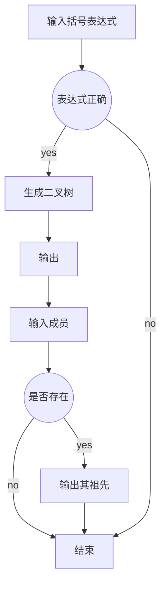

## 实验说明
>要求完成的功能如下，测试输出如图  所示：
>（1） 输入一棵二叉树的括号表示法，完成树的构建
>（2） 使用后序遍历递归算法遍历二叉树并输出
>（3） 使用先序遍历非递归算法遍历二叉树并输出
>（4） 指定家谱中的某一成员，输出其所有长辈
>测试例：
>输入：A(B(C(E,F),D(G(M,N),H)),)
>输出：
>M 的长辈为：FCNGHDBA
>N 的长辈为：HDBA
---
## 流程图
以下为该实验的流程图

